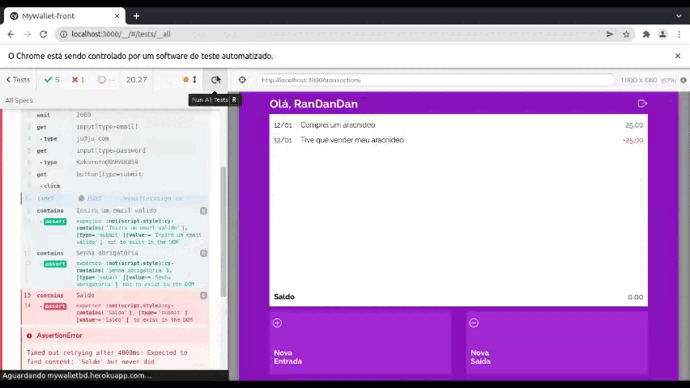

# 

MyWallet é uma carteira digital com o objetivo de observar e controlar suas finanças por meio do registro das entradas e saídas, exibindo também o estado atual do saldo.

## Iniciar

### Clone este repositório ou faça download do arquivo zip :

`git clone https://github.com/sZeuSz/Projeto_14-MyWallet-front.git`

### No repositório do projeto na sua máquina, para instalar todas as dependências utilizadas, digite:

`npm i`

### e por fim:

`npm start`

### Este projeto foi desenvolvido com:

- React
  - React Router DOM
  - React Icons
  - React Hook Forms
  - Yup
  - Styled Components
  - Cypress
  - React Loader Spinner
  - Axios

### Teste:

Esse projeto foi testado usando cypress para o front-end, veja abaixo o examplo do teste rodando:

### Demo:

https://mywallet-one.vercel.app
